# progress-report-404notfound

| Group Name:  404NotFound |                |
|:------------------------ |:-------------- |
|                          |                |
| **Team Members**         | **Student ID** |
| 赵晓蕾                      | 11910937       |
| 段轶                       | 11911133       |
| 陈梓涵                      | 11910507       |
| 刘通                       | 11910903       |
| 张庭境                      | 11911919       |

-  Summary of working issues and the pull requests 

| Project     | Issues link                                                  | Pull Request/commit link                                     | Issue status           |
| ----------- | ------------------------------------------------------------ | ------------------------------------------------------------ | ---------------------- |
| modelmapper | [Issue #660](https://github.com/modelmapper/modelmapper/issues/660) | [pull request](https://github.com/modelmapper/modelmapper/pull/663) | Pull Request Merged    |
| modelmapper | [Issue #572](https://github.com/modelmapper/modelmapper/issues/572) | [pull request](https://github.com/modelmapper/modelmapper/pull/664) | Pull Request Merged    |
| modelmapper | [Issue #639](https://github.com/modelmapper/modelmapper/issues/639) | [pull request](https://github.com/modelmapper/modelmapper/pull/639) | Pull Request Merged    |
| modelmapper | [Issue #633](https://github.com/modelmapper/modelmapper/issues/633) | [pull request](https://github.com/modelmapper/modelmapper/pull/665) | Pull Request Submitted |
| modelmapper | [Issue #578](https://github.com/modelmapper/modelmapper/issues/578) | [pull request](https://github.com/modelmapper/modelmapper/pull/669) | Pull Request Merged    |
| modelmapper | [Issue #630](https://github.com/modelmapper/modelmapper/issues/630) | [pull request](https://github.com/modelmapper/modelmapper/pull/671) | Pull Request Accepted  |
| modelmapper | [Issue #278](https://github.com/modelmapper/modelmapper/issues/278) | [pull request](https://github.com/modelmapper/modelmapper/pull/674) | Pull Request Accepted  |
| modelmapper | [Issue #571](https://github.com/modelmapper/modelmapper/issues/571) | [pull request](https://github.com/modelmapper/modelmapper/pull/672) | Pull Request Accepted  |
| modelmapper | [Issue #147](https://github.com/modelmapper/modelmapper/issues/147) | [pull request](https://github.com/modelmapper/modelmapper/pull/675) | Pull Request Accepted  |
| modelmapper | [Issue #164](https://github.com/modelmapper/modelmapper/issues/164) | [pull request](https://github.com/modelmapper/modelmapper/pull/673) | Pull Request Submitted |
| modelmapper | [Issue #646](https://github.com/modelmapper/modelmapper/issues/646) | [pull request](https://github.com/modelmapper/modelmapper/pull/677) | Pull Request Submitted |

## Issue fix

 a) Reasons for choosing these issues

[modelmapper issues #572](https://github.com/modelmapper/modelmapper/issues/572)

The reason I choose this issue is because this issue is easy to work. At first time I look at the project, I think that it may hard for me to work for the project do a not easy but interesting work--turn a object into another object based on setting rules. So a easy issue can help me read the whole project well.

[modelmapper issue #660](https://github.com/modelmapper/modelmapper/issues/660)

The UUID, short for Universally Unique Identifier, is a 128-bit number which is a standard for software construction.  Ethernet card addresses, nanosecond time, chip ID codes, and many possible numbers were used in calculations. The goal is to allow all elements in a distributed system to have unique identification information, without the need for a central controller to specify identification information. This way, each person can create a UUID that is guaranteed to be unique to all machines in the same space and time. In this case, there is no need to worry about name duplication at database creation. However, the tool previously did not support the UUID type and threw an exception when referring to a UUID. So we need a UUID Converter to do the conversion.

[modelmapper issue #633](https://github.com/modelmapper/modelmapper/issues/633)

Reason: This issue expose a bug that the skip() won't work while mapping a Object, Object is used frequently in the Java language, this bug can cause a lot of trouble for ModelMapper users, so I think fixing this issue is urgent, that is why I choose this issue as my first issue.

[modelmapper issue #639](https://github.com/modelmapper/modelmapper/issues/639)

Reason: This issue incorrectly use of condition() functions, this bug can cause a lot of trouble for ModelMapper users, so I think fixing this issue is urgent, that is why I choose this issue as my first issue.

[modelmapper issue #278](https://github.com/modelmapper/modelmapper/issues/278)

I chose this issue because it shows a very real problem -- ModelMapper can't successfully map a HashMap type with a list correctly. I thought trying this issue would help me better understand the whole project, so I chose it.

b) Scenarios

[modelmapper issues #572](https://github.com/modelmapper/modelmapper/issues/572)

The test case test if the emptyTypeName can recognize two different typeMap. For the first one, we name it turing; for the second one we name it fail. The turning can well work but the fail cannot work. So the emptyTypeMap with typeName implement well.
```java
    public static void main(String[] args) {
        ModelMapper modelMapper = new ModelMapper();
        Animal dog = new Animal();
        dog.name = "dog";
        dog.weight = 50;

        modelMapper.emptyTypeMap(Animal.class, AnimalDTO.class, "turning").addMappings(mapper -> {mapper.map(Animal::getName, AnimalDTO::setName); mapper.map(Animal::getWeight, AnimalDTO::setWeight);});
        AnimalDTO dog_DTO = modelMapper.map(dog, AnimalDTO.class, "turning");

        assertEquals(dog.weight, dog_DTO.weight);
        assertEquals(dog.name, dog_DTO.name);

        modelMapper.emptyTypeMap(Animal.class, AnimalDTO.class, "fail");
        AnimalDTO dog_DTO2 = modelMapper.map(dog, AnimalDTO.class, "fail");

        assertNotEquals(dog.weight, dog_DTO2.weight);
        assertNotEquals(dog.name, dog_DTO2.name);

    }

```

[modelmapper issue #660](https://github.com/modelmapper/modelmapper/issues/660)

Scenario1: We try to project the type string to UUID, and this is a simple scenario. It should project to the UUID type successfully.

```java
 /**
   * Test mapping the String to UUID type}.
   */
    @Test
    public void test1 () {
        String a = "87180668-ace8-4204-950e-dda74c55f703";
        ModelMapper modelMapper = new ModelMapper();
        UUID uuid = modelMapper.map(a,UUID.class);
        assert uuid.toString().equals(a);
    }
```

Scenario2: This scenario is more complex. UUIDObj and UUIDObjDTO are two objects and it can flatten and project from each other. The fields in these two java classes should match correctly.

```java
/**
   * Test mapping the UUIDObj to UUIDObjDTO}.
   */
    @Test
    public void test2 () {
        ModelMapper modelMapper = new ModelMapper();
        UUIDObj uuidObj = new UUIDObj();
        UUIDObjDTO uuidObjDTO= modelMapper.map(uuidObj,UUIDObjDTO.class);
        assert uuidObjDTO.getUuid().toString().equals(uuidObj.getUuid());
    }
```

[modelmapper issue #639](https://github.com/modelmapper/modelmapper/issues/639)

Scenario1: We try to map all null attributes of updates to obj, and this is a simple scenario. The obj is not modifed. Test SUCCEED.

```java
    @Test
    public void testAllNull() {
        ModelMapper mapper = new ModelMapper();
        MyObject obj = new MyObject("bar", List.of("a", "b", "c"));
        MyObject updates = new MyObject( null,null);
        // obj should be updated using the updates object. All null values should not be updated.

        System.out.println("------------------- TEST 1 -------------------");
        mapper.getConfiguration().setPropertyCondition(Conditions.isNotNull());
        mapper.map(updates,obj);
        assertEquals("MyObject{myStringProperty='bar', myListProperty=[a, b, c]}", obj.toString());
    }
```

Scenario2:We try to map all non-null attributes of updates to obj. All values of object is modifed. Test SUCCEED.

```java
@Test
    public void testAllNotNull() {
        ModelMapper mapper = new ModelMapper();
        MyObject obj = new MyObject("bar", List.of("a", "b", "c"));
        MyObject updates = new MyObject( "candy", List.of("a", "b", "c","d"));
        // obj should be updated using the updates object. All null values should not be updated.

        System.out.println("------------------- TEST 1 -------------------");
        mapper.getConfiguration().setPropertyCondition(Conditions.isNotNull());
        mapper.map(updates,obj);
        assertEquals("MyObject{myStringProperty='candy', myListProperty=[a, b, c, d]}", obj.toString());
    }
```

Scenario3:We try to map only one non-null attributes of updates to obj. Only not null values of updates is modifed to obj. Test SUCCEED.

```java
@Test
    public void testOnlyOneNull() {
        ModelMapper mapper = new ModelMapper();
        MyObject obj = new MyObject("bar", List.of("a", "b", "c"));
        MyObject updates = new MyObject( "candy", null);
        // obj should be updated using the updates object. All null values should not be updated.

        System.out.println("------------------- TEST 1 -------------------");
        mapper.getConfiguration().setPropertyCondition(Conditions.isNotNull());
        mapper.map(updates,obj);
        assertEquals("MyObject{myStringProperty='candy', myListProperty=[a, b, c]}", obj.toString());
    }
```

[modelmapper issue #633](https://github.com/modelmapper/modelmapper/issues/633)

```java
package org.modelmapper.test;

import org.modelmapper.ModelMapper;

class A {

    private String field1;
    private String field2;

    private B b;

   // getters and setters
}

class B {

    private String fieldB1;
    private String fieldB2;

    // getters and setters
}

class ADto {

    private String field1;
    private String field2;

    private BDto b;

    // getters and setters
}

class BDto {

    private String fieldB1;
    private String fieldB2;

    // getters and setters
}

public class Main {
    public static void main(String[] args) {
        ModelMapper modelMapper = new ModelMapper();
        modelMapper.typeMap(A.class, ADto.class, "LAZY")
                .addMappings(mapper -> mapper.skip(ADto::setB))
                .addMappings(mapper -> mapper.skip(ADto::setField2));
        A a = new A();
        B b = new B();
        b.setFieldB1("b1");
        b.setFieldB2("b2");
        a.setField1("a1");
        a.setField2("a2");
        a.setB(b);
        ADto aDto = modelMapper.map(a, ADto.class, "LAZY");
        System.out.println("aDto EXPECTED: [field1: a1, field2: null, b: null]");
        if (aDto.getB() != null)
            System.out.println("aDto ACTUAL: [field1: "+ aDto.getField1() + ", field2: "+ aDto.getField2() + ", b[fieldB1: "+ aDto.getB().getFieldB1() + ", fieldB2: "+ aDto.getB().getFieldB2() + "]]");
        else
            System.out.println("aDto ACTUAL: [field1: "+ aDto.getField1() + ", field2: "+ aDto.getField2() + ", b: "+ aDto.getB()+ "]");
    }
}
```

Only a comparison between object with field and without field can show the bug, so only one test is enough

Scenario Reproduction:

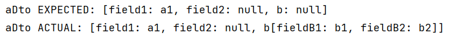

After fixing:

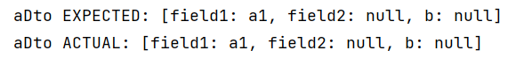 

[modelmapper issue #278](https://github.com/modelmapper/modelmapper/issues/278)

I have not completed fixing this issue, but now I have reproduced this problems.

```java
/**
   * Test if we can map Map<String, List<SomeObject>>.
   */
    @Test
        public void testMapToDto() {
            A source = new A();
            source.setAuthor("Author");
            Map<String, List<B>> map = new HashMap<>();
            List<B> list = new ArrayList<>();
            B b = new B();
            b.setTitle("a title");
            list.add(b);
            map.put("key 1", list);
            source.setMyMap(map);

            ADto aDto = modelMapper.map(source, ADto.class);

            Assert.assertEquals(2, aDto.getMyMap().size());
            Assert.assertEquals(aDto.getMyMap().get("key 1").get(0).getClass(), BDto.class);
        }
```

A, ADto, B and BDto are defined as follows respectively:

```java
class A {
    private String author;
    private Map<String, List<B>> myMap;

    public A() { this.myMap = new HashMap<>(); }
    
    // getters and setters
}

class B {
    private String title;

    // getters and setters
}

class ADto {
    private String author;
    private Map<String, List<BDto>> myMap;

    public ADto() { this.myMap = new HashMap<>(); }

    // getters and setters
}


class BDto {
    private String title1;

    // getters and setters
}
```

We can see that after executing  ```java ADto aDto = modelMapper.map(source, ADto.class); ``` , the element corresponding to "key1" in aDTO's map is a list of type B, not a list of type BDto. Therefore, when executing  ```java ADto aDto = modelMapper.map(source, ADto.class); ``` , this will be displayed:
```java
java.lang.ClassCastException: org.B cannot be cast to org.BDto
```

c)

- [modelmapper issues #572](https://github.com/modelmapper/modelmapper/issues/572):
  
   [pull request](https://github.com/modelmapper/modelmapper/pull/664)
   
- [modelmapper issues #660](https://github.com/modelmapper/modelmapper/issues/660):

   [pull request](https://github.com/modelmapper/modelmapper/pull/663)

* [modelmapper issue #633 ](https://github.com/modelmapper/modelmapper/issues/633)：

  [pull request](https://github.com/modelmapper/modelmapper/pull/665)
  
- [modelmapper issues #639](https://github.com/modelmapper/modelmapper/issues/639):

   [pull request](https://github.com/modelmapper/modelmapper/pull/639)


d)Three static analysis tools

[modelmapper issues #572](https://github.com/modelmapper/modelmapper/issues/572):

##### Checkstyle

The problem here is because I follow the rule of developer.

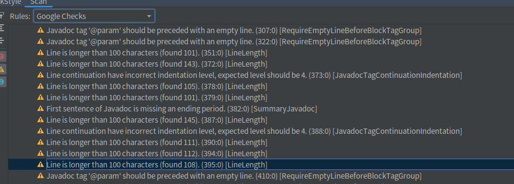

##### PMD

The problem of PMD test for me is because I follow the rules with the developer.

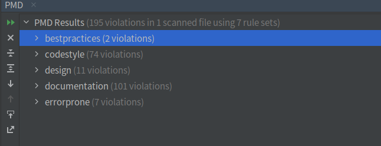

##### SpotBugs

There is an error, but this error is not my work, it is developer's variable.

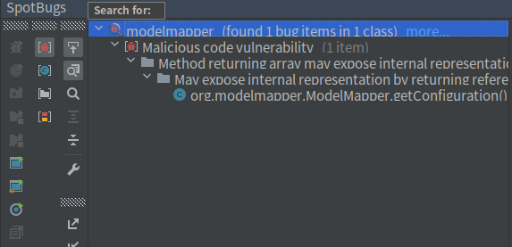

 [modelmapper issues #660](https://github.com/modelmapper/modelmapper/issues/660):
##### Checkstyle

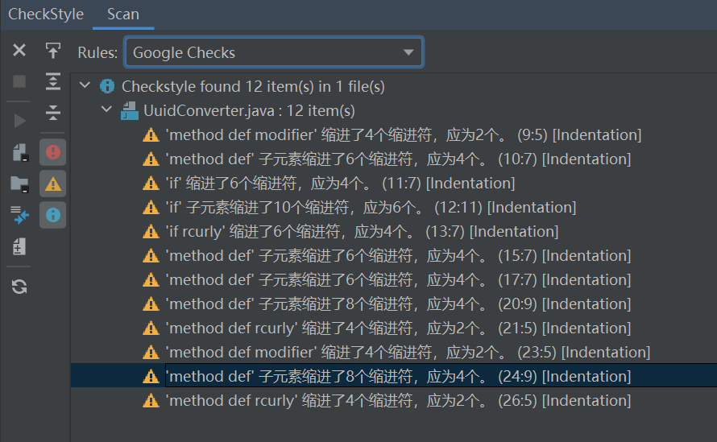

##### PMD
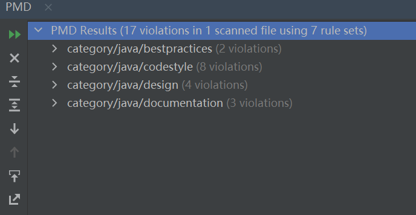

##### SpotBugs
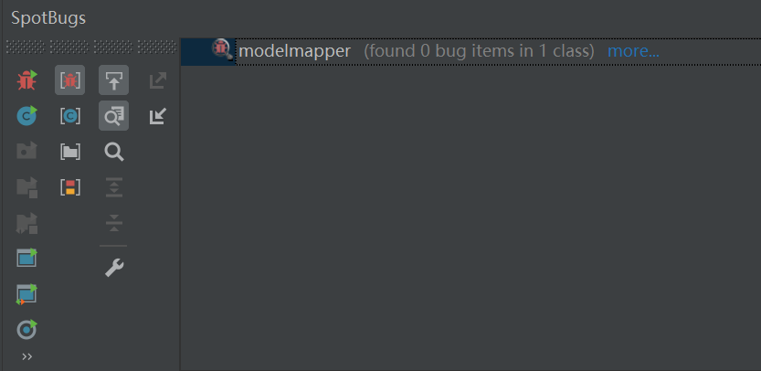

[modelmapper issues #639](https://github.com/modelmapper/modelmapper/issues/639):
##### Checkstyle

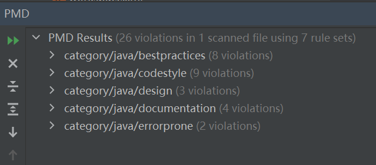

##### PMD
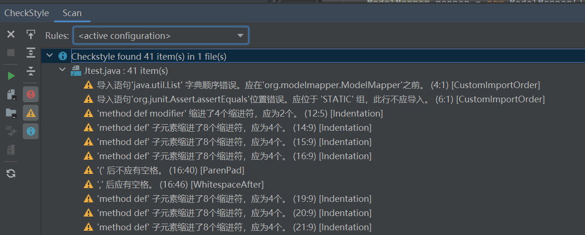

##### SpotBugs
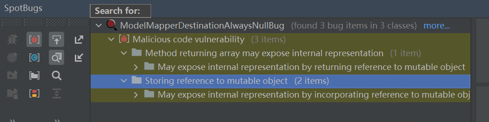

[modelmapper issue #633](https://github.com/modelmapper/modelmapper/issues/633)

##### Checkstyle

these are not the problems of my code

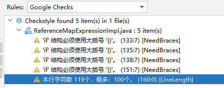 

##### PMD

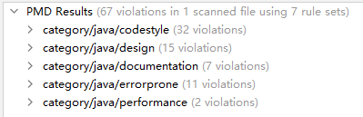 

##### SpotBugs 

 

[modelmapper issue #278](https://github.com/modelmapper/modelmapper/issues/278)

##### Checkstyle

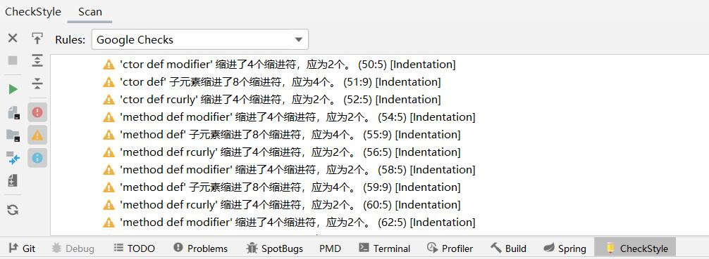 

##### PMD

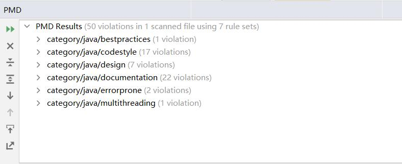 

##### SpotBugs 

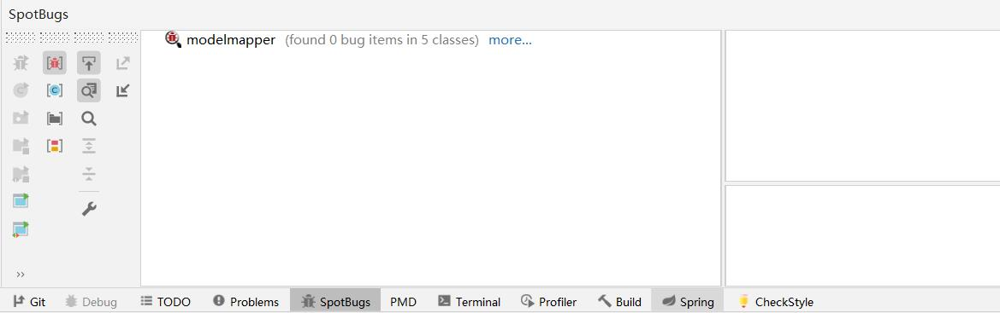 


